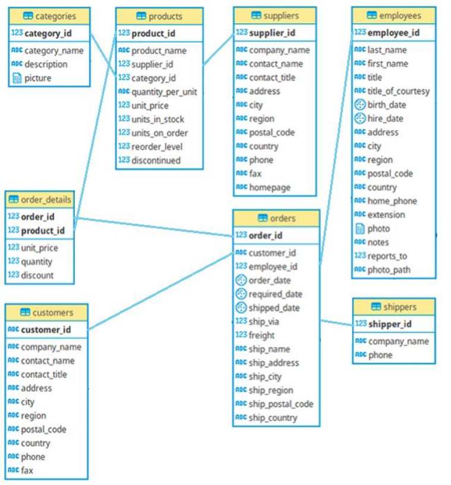

# Setup Northwind Database on Postgres running on Docker 

## Dataset introduction
**The Northwind database** is a sample database used by *Microsoft* to demonstrate the features of some of its products, including *SQL Server* and *Microsoft Access*. The database contains the sales data for Northwind Traders, a fictitious specialty foods export­ import company.

Although the code taught in this class is not specific to Microsoft products, Northwind database can be used for many of our examples because many people are already familiar with it and because there are many resources for related learning that make use of the same
database.

## Dataset Schema

## This Project
The main objective of this repository is provide a Docker containerization of this csv files in a *Postgres* database. Is perfectly possible use data from flat files, but can be useful having this data in a relational database system.

## How it works

The data in csv format is stored on *data/raw/*. The scripts to create the tables on Postgres are on *scripts/sql/*.

After cloning this repository and run **docker-composer up** it will create the tables on Postgres and fill it with data from csv.

After that you can connect to Postgres instance with any tool that you need.

### Parameters

You can change parameters in `docker-compose.yaml` file.

**POSTGRES_USER:**	The Postgres user to connect Postgres.

**POSTGRES_PASSWORD:**	The Postgres password to connect Postgres.

**POSTGRES_DB:**	The Postgres database name to connect Postgres.

**port:** The port mapped by Postgres is **5432** in your container. If you have other Postgres instances running, you have to change it.

### Run

Clone or download this repository, and run `$ docker-compose up`.